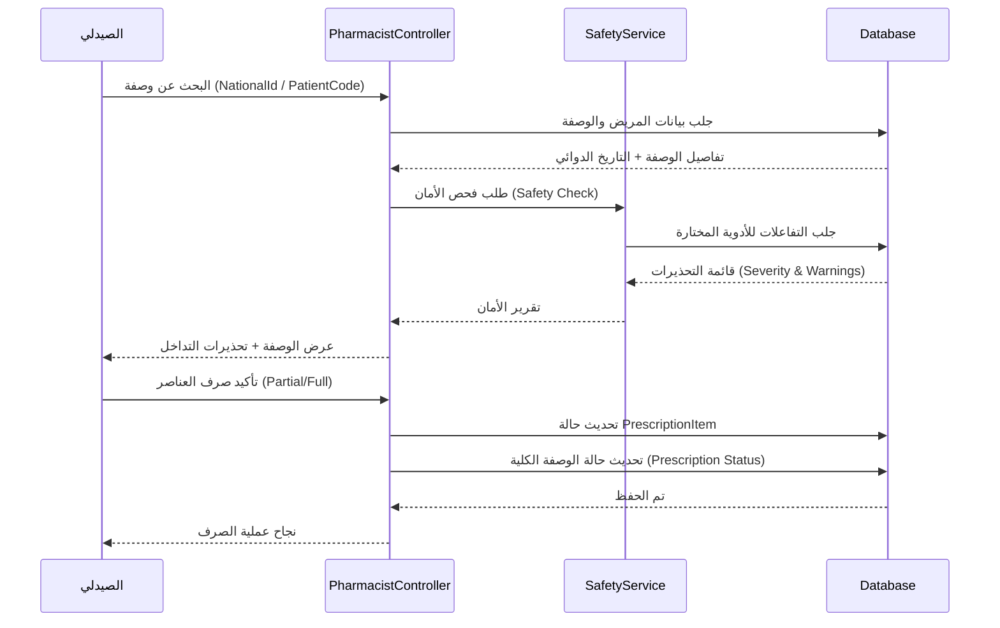
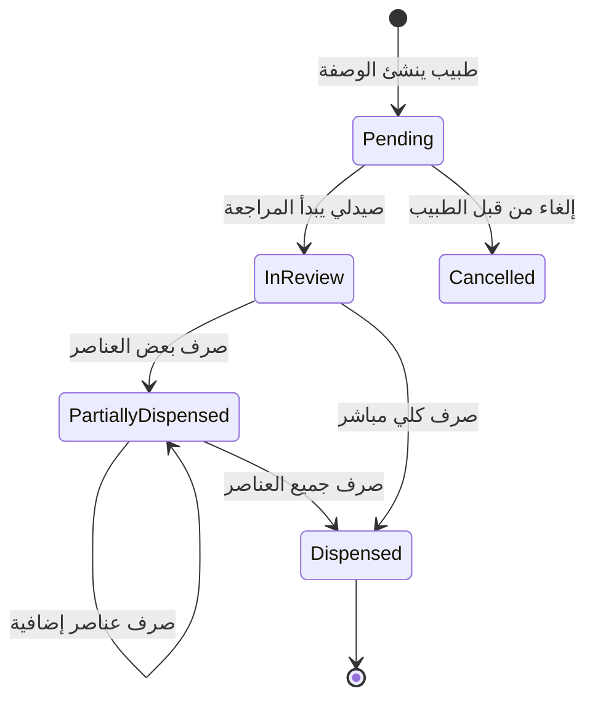

# توثيق مشروع تخرج: نظام السجلات الطبية المركزي (Integrated Patient Medical Records System)

هذا التوثيق تم إعداده بأسلوب أكاديمي بحثي شامل ليكون بمثابة العمود الفقري لرسالة التخرج.

---

## الفصل الأول: مدخل الدراسة (Project Foundation)

### 1.1 التعريف بالمشروع
يمثل المشروع نظاماً متكاملاً لإدارة السجلات الطبية، يربط بين الأطراف الثلاثة للعملية الصحية (المريض، الطبيب، الصيدلي) من خلال منصة سحابية موحدة تعتمد على تقنيات الـ API لتسهيل تداول البيانات الحيوية بأمان وكفاءة.

### 1.2 الأهمية الأكاديمية والعملية
تكمن أهمية المشروع في معالجة إشكالية "انقطاع تسلسل البيانات الطبية" (Medical Data Continuity)، حيث يوفر النظام حلاً تقنياً يسمح للطبيب بالاطلاع على التاريخ المرضي للمريض مهما كان مكان تلقي العلاج السابق، مع توفير طبقة أمان إضافية لمنع الأخطاء الدوائية.

---

## الفصل الثاني: تحليل المتطلبات والعمليات (Requirements & Business Logic)

### 2.1 سيناريوهات الاستخدام التفصيلية (Use Case Narratives)

#### السيناريو (1): تسجيل حساب مهني (طبيب/صيدلي)
*   **الفاعل الرئيسي:** طبيب أو صيدلي.
*   **الهدف:** إنشاء حساب لممارسة المهنة داخل النظام.
*   **المسار الناجح:**
    1.  يقوم المستخدم بإدخال بياناته (الرقم الوطني، الاسم، رقم الترخيص، جهة العمل).
    2.  يقوم النظام بالتحقق من عدم تكرار الرقم الوطني.
    3.  يتم حفظ الحساب بحالة "Pending" (قيد الانتظار).
    4.  يقوم المسؤول (Admin) بمراجعة البيانات وتفعيل الحساب.
*   **حالات الفشل:**
    - رقم وطني مسجل مسبقاً (Status: BadRequest).
    - بيانات ناقصة أو غير صالحة (Validation Error).

#### السيناريو (2): فحص التداخلات الدوائية (Clinical Safety Check)
*   **الفاعل الرئيسي:** الطبيب أو الصيدلي.
*   **الهدف:** التأكد من سلامة الأدوية الموصوفة للمريض.
*   **المسار الناجح:**
    1.  يطلب النظام جلب الأدوية الحالية للمريض من قاعدة البيانات.
    2.  يتم تحويل كافة الأدوية (الحالية والجديدة) إلى قائمة المكونات الفعالة (Ingredients).
    3.  تقوم خوارزمية البحث المتقاطع بفحص وجود تداخلات مسجلة في جدول `DrugInteractions`.
    4.  يتم إرجاع تحذيرات تشمل (الخطورة، الوصف، التوصية).

#### السيناريو (3): البحث عن مريض والوصول لسجله (Patient Search & Access)
*   **الفاعل الرئيسي:** الطبيب.
*   **الهدف:** الاطلاع على التاريخ الطبي للمريض لاتخاذ قرار سريري.
*   **المسار الناجح (عبر الرقم الوطني):**
    1.  يدخل الطبيب الرقم الوطني للمريض.
    2.  يتحقق النظام من وجود المريض وصلاحية وصول الطبيب.
    3.  يتم عرض الملف الطبي (التشخيصات، الحساسية، العمليات السابقة).
*   **المسار البديل (حالة الطوارئ - QR):**
    1.  يقوم الطبيب بمسح رمز الـ QR الخاص بالمريض.
    2.  يقوم النظام بالتحقق من "توكن الوصول المؤقت" (Access Token) المشفر داخل الرمز.
    3.  يمنح النظام وصولاً مؤقتاً (لفترة 5 دقائق مثلاً) للسجل الطبي.
*   **حالات الفشل:**
    - المريض غير مسجل (404 Not Found).
    - انتهاء صلاحية رمز الـ QR (Status: Unauthorized).

### 2.2 مخطط النشاط: دورة حياة تسجيل الحساب (Activity Diagram)

```mermaid
activityDiagram
    start
    :إدخال بيانات التسجيل;
    if (البيانات صالحة؟) then (نعم)
        :التحقق من فرادة الرقم الوطني;
        if (موجود مسبقاً؟) then (نعم)
            :إظهار خطأ: الحساب موجود;
            stop
        else (لا)
            :حفظ الحساب كـ Pending;
            :إشعار المسؤول بالمراجعة;
            if (موافقة المسؤول؟) then (نعم)
                :تغيير الحالة إلى Approved;
                :إرسال إشعار تفعيل للمستخدم;
            else (لا)
                :تغيير الحالة إلى Rejected;
                :إرسال سبب الرفض;
            endif
        endif
    else (لا)
        :إظهار أخطاء التحقق;
        stop
    endif
    stop
```

---

## الفصل الثالث: التصميم الفني (System Design & Data Architecture)

### 3.1 قاموس البيانات (Data Dictionary)

#### جدول المستخدمين (Users Table)
| اسم الحقل | النوع | القيود | الوصف |
| :--- | :--- | :--- | :--- |
| `Id` | Integer | PK, Identity | المعرف الفريد للمستخدم |
| `NationalId` | String | Unique, Required | الرقم الوطني (يستخدم كمعرف دخول) |
| `PasswordHash`| String | Required | كلمة المرور المشفرة بـ BCrypt |
| `Status` | Enum | Required | حالة الحساب (Pending, Approved, etc) |
| `FullName` | String | Max 100 | الاسم الكامل للمستخدم |

#### جدول الأدوية (Drugs Table)
| اسم الحقل | النوع | القيود | الوصف |
| :--- | :--- | :--- | :--- |
| `Id` | Integer | PK | المعرف الفريد للدواء |
| `ScientificName`| String | Required | الاسم العلمي للدواء |
| `BrandName` | String | - | الاسم التجاري للدواء |
| `NormalizedName`| String | Indexed | الاسم بصيغة موحدة للبحث السريع |

### 3.2 مخطط التتابع: عملية صرف الوصفة (Sequence Diagram)



---

## الفصل الرابع: التنفيذ والأمن البرمجي (Implementation & Security)

### 4.1 معمارية الأمن (Security Middleware)
تم تنفيذ نظام أمني متعدد الطبقات يعتمد على:
1.  **JWT Rotation:** يتم تجديد التوكن تلقائياً لضمان عدم سرقته واستخدامه لفترة طويلة.
2.  **Role-Based Access Control (RBAC):** استخدام مطالبات (Claims) الأدوار للتحقق من الصلاحيات على مستوى الـ Endpoint.
3.  **Data Isolation:** فصل بيانات المريض بحيث لا يمكن الوصول إليها إلا من خلال توكن معتمد أو عبر QR الطوارئ في حالات محددة.

### 4.2 مخطط الحالة: دورة حياة الوصفة (State Diagram)



---

## الفصل الخامس: ضمان الجودة والاختبار (Testing & QA)

### 5.1 مصفوفة حالات الاختبار (Test Cases Matrix)

| كود الاختبار | العملية | المدخلات | النتيجة المتوقعة | الحالة |
| :--- | :--- | :--- | :--- | :--- |
| TC-01 | تسجيل الدخول | بيانات صحيحة | توليد توكن JWT بنجاح | Pass |
| TC-02 | تسجيل الدخول | كلمة مرور خاطئة | رسالة Unauthorized (401) | Pass |
| TC-03 | فحص التداخل | دواءين متفاعلين | ظهور تحذير Severity: High | Pass |
| TC-04 | صرف دواء | كمية غير متوفرة | رسالة خطأ: الكمية غير كافية | Pass |
| TC-05 | تفعيل بروفايل | طبيب يطلب دور مريض | إضافة دور مريض لنفس الحساب | Pass |

---

## الفصل السادس: التحليل الفني العميق (Deep Technical Analysis)

### 6.1 معمارية الهوية الموحدة (Hybrid Identity Architecture)
أحد التحديات الأكاديمية التي عالجها المشروع هو إمكانية امتلاك المستخدم الواحد لأدوار متعددة (طبيب، صيدلي، مريض) في نظام واحد دون تكرار البيانات.

**الحل البرمجي المنفذ:**
تم فصل "المستخدم" ككيان أساسي للتحقق (Authentication) عن "الأدوار" (Roles) و "الملفات الشخصية" (Profiles).
*   يحتوي جدول `Users` على بيانات الدخول.
*   يحتوي جدول `UserRoleAssignments` على قائمة الصلاحيات.
*   ترتبط جداول `Patients`, `Doctors`, `Pharmacists` بالمستخدم عبر `UserId` (علاقة 1-to-1 اختيارية).

```csharp
// مثال على كود توليد التوكن لدعم تعدد الأدوار
var roles = new HashSet<string>();
roles.Add(user.Role.ToString()); // الدور الأساسي
foreach (var roleAssignment in user.Roles) {
    roles.Add(roleAssignment.Role.ToString()); // الأدوار الإضافية
}
foreach (var role in roles) {
    claims.Add(new Claim(ClaimTypes.Role, role));
}
```

### 6.2 تحليل خوارزمية فحص التفاعلات (Algorithm Complexity)
تعتمد الخوارزمية على تقاطع المجموعات (Set Intersection).
*   **المدخلات:** مجموعة أدوية المريض الحالية ($C$) ومجموعة الأدوية الجديدة ($N$).
*   **المعالجة:** تحويل كل دواء $d$ إلى مجموعة مكوناته الفعالة $I(d)$.
*   **البحث:** البحث في قاعدة بيانات التفاعلات عن أي زوج $(i_1, i_2)$ حيث $i_1 \in \bigcup I(d), d \in (C \cup N)$.
*   **التعقيد الزمني:** تم تحسين البحث من $O(n^2)$ إلى $O(n)$ في عمليات الاستيراد الضخمة باستخدام جداول الهاش (Hash Tables / Dictionaries)، مما يضمن استجابة فورية حتى مع وجود آلاف التفاعلات.

### 6.3 بروتوكول بيانات الطوارئ (Offline QR Protocol)
لضمان العمل في بيئات منقطعة الاتصال، تم ابتكار بروتوكول نصي لتخزين البيانات داخل الـ QR. يتم تخزين البيانات بالشكل التالي:
`[الاسم]|[فصيلة الدم]|[الحساسية]|[الأدوية]|[جهة الاتصال]`
يتم تشفير هذه السلسلة أو ضغطها ثم تحويلها إلى رمز QR بـ **Error Correction Level: Medium (M)** لضمان قابليته للقراءة حتى في حال تلف جزء من الرمز.

---

## الفصل السابع: الملاحق الفنية (Technical Appendices)

### 7.1 قائمة رموز الحالة (HTTP Status Codes) المستخدمة
*   `200 OK`: نجاح العملية وجلب البيانات.
*   `201 Created`: نجاح إنشاء حساب أو سجل جديد.
*   `400 Bad Request`: فشل في التحقق من البيانات المرسلة (Validation Error).
*   `401 Unauthorized`: التوكن منتهي الصلاحية أو غير موجود.
*   `403 Forbidden`: المستخدم لا يملك الصلاحية (مثلاً صيدلي يحاول كتابة وصفة).
*   `404 Not Found`: المريض أو الدواء غير موجود.

### 7.2 نماذج لتبادل البيانات (JSON Samples)

**طلب إنشاء وصفة طبية (Post Prescription):**
```json
{
  "patientId": 123,
  "diagnosis": "التهاب حاد في اللوزتين",
  "items": [
    {
      "drugId": 45,
      "dosage": "500mg",
      "frequency": "3 مرات يومياً",
      "duration": "7 أيام",
      "quantity": 1
    }
  ]
}
```

**رد فحص التداخلات (Interaction Check Response):**
```json
{
  "hasInteractions": true,
  "warnings": [
    {
      "medication1": "Warfarin",
      "medication2": "Aspirin",
      "severity": "High",
      "description": "يزيد من خطر النزيف الحاد",
      "recommendation": "يجب تعديل الجرعة أو استبدال أحد الدواءين"
    }
  ]
}
```

---
*هذا التوثيق يمثل المرجعية الفنية الكاملة للنظام، مصمم لتغطية كافة الجوانب التحليلية والتصميمية المطلوبة في مناقشات مشاريع التخرج.*
