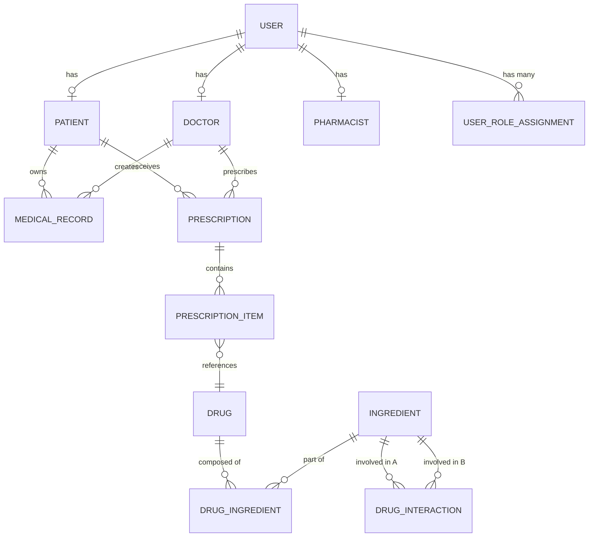
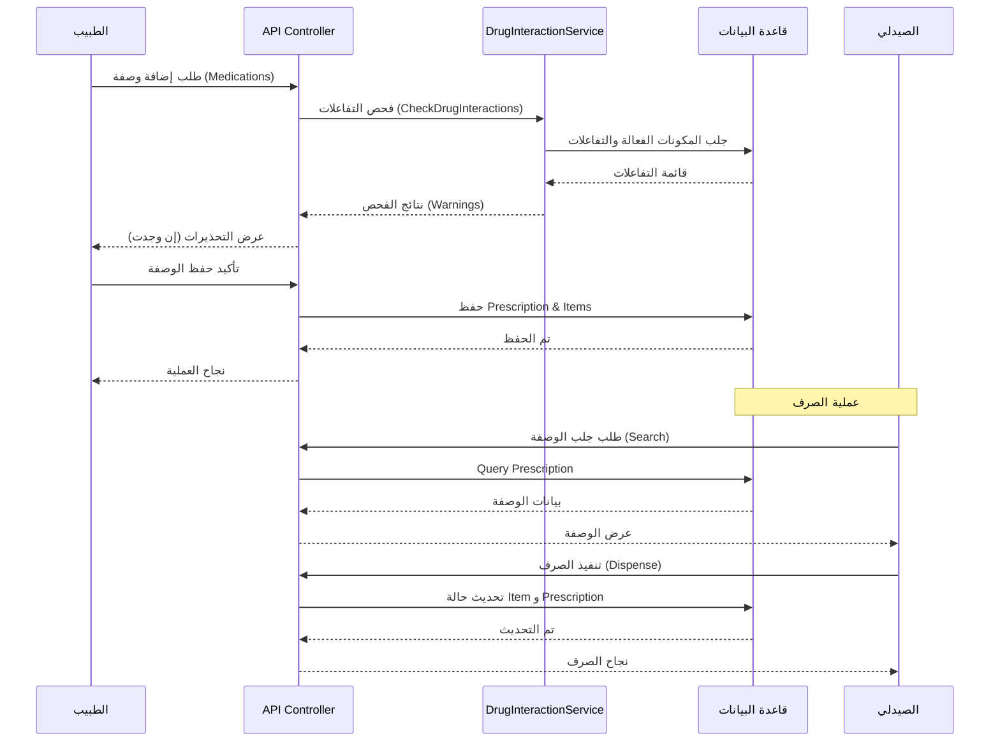

# توثيق مشروع تخرج: نظام السجلات الطبية للمرضى (Patient Medical Records System)

هذا المستند يمثل دراسة تحليلية فنية متكاملة للمشروع، مصممة لتكون مرجعاً أساسياً لكتابة دفتر التخرج (Thesis) بأسلوب أكاديمي احترافي.

---

## الفصل الأول: مقدمة المشروع (Introduction)

### 1.1 خلفية عن المشروع
في ظل التطور الرقمي المتسارع، لا تزال السجلات الطبية الورقية أو المشتتة بين المستشفيات تشكل عائقاً أمام تقديم الرعاية الصحية المثلى. يهدف هذا المشروع إلى بناء نظام مركزي آمن لإدارة السجلات الطبية يعتمد على تقنيات الـ API لضمان سهولة الوصول وتكامل البيانات.

### 1.2 مشكلة البحث (Problem Statement)
*   **تشتت البيانات:** صعوبة وصول الطبيب إلى التاريخ المرضي الكامل للمريض إذا زار منشآت مختلفة.
*   **مخاطر التداخلات الدوائية:** غياب آلية آلية لفحص تضارب الأدوية عند كتابة وصفات جديدة.
*   **حالات الطوارئ:** فقدان البيانات الحيوية للمريض (مثل فصيلة الدم والحساسية) في الأماكن التي لا تتوفر فيها شبكة إنترنت.

### 1.3 أهداف المشروع
1.  توفير واجهة برمجة تطبيقات (API) مركزية لإدارة بيانات المرضى والأطباء والصيادلة.
2.  تطوير خوارزمية ذكية لفحص التفاعلات الدوائية بناءً على المادة الفعالة (Active Ingredients).
3.  ابتكار وسيلة وصول سريعة (Offline QR Code) تحتوي على البيانات الحيوية للمريض للعمل في ظروف الطوارئ.
4.  تطبيق معايير أمنية صارمة باستخدام JWT لضمان خصوصية البيانات.

---

## الفصل الثاني: تحليل النظام (System Analysis)

### 2.1 المتطلبات الوظيفية (Functional Requirements)
*   **إدارة الهوية:** التسجيل والتحقق من الهوية للأدوار الأربعة (مريض، طبيب، صيدلي، مسؤول).
*   **الملف الطبي:** تسجيل التشخيصات، العمليات، والأمراض المزمنة.
*   **محرك الوصفات:** إنشاء الوصفات الطبية مع فحص آلي للتداخلات.
*   **الصرف الدوائي:** تتبع صرف الأدوية (كلي أو جزئي) من قبل الصيادلة.
*   **نظام الـ QR:** توليد رموز QR مشفرة تحتوي على بيانات المريض الخام للوصول السريع.

### 2.2 المتطلبات غير الوظيفية (Non-Functional Requirements)
*   **الأمن (Security):** تشفير كلمات المرور (BCrypt) وحماية الـ Endpoints باستخدام JWT.
*   **التوافر (Availability):** دعم الوصول للبيانات الأساسية بدون إنترنت عبر الـ QR.
*   **الأداء (Performance):** استجابة سريعة لطلبات فحص الأدوية باستخدام القواميس (Dictionaries) في الذاكرة.

### 2.3 مخطط حالات الاستخدام (Use Case Diagram)

```mermaid
useCaseDiagram
    actor "المريض" as Patient
    actor "الطبيب" as Doctor
    actor "الصيدلي" as Pharmacist
    actor "المسؤول" as Admin

    package "API النظام" {
        usecase "إدارة الحساب والأدوار" as UC1
        usecase "عرض السجل الطبي" as UC2
        usecase "كتابة وصفة طبية" as UC3
        usecase "فحص التداخلات الدوائية" as UC4
        usecase "صرف الدواء" as UC5
        usecase "توليد QR الطوارئ" as UC6
    }

    Patient --> UC1
    Patient --> UC2
    Patient --> UC6

    Doctor --> UC1
    Doctor --> UC2
    Doctor --> UC3
    Doctor --> UC4

    Pharmacist --> UC1
    Pharmacist --> UC5
    Pharmacist --> UC4

    Admin --> UC1
```

---

## الفصل الثالث: تصميم النظام (System Design)

### 3.1 المعمارية البرمجية (System Architecture)
يعتمد النظام على معمارية **N-Tier Architecture** موزعة كالتالي:
1.  **Presentation Layer:** واجهة المسؤول (MVC) وتطبيقات الويب/الموبايل الأخرى.
2.  **API Layer (Application):** المتحكمات (Controllers) التي تعالج طلبات الـ HTTP.
3.  **Service Layer (Business Logic):** حيث توجد الخوارزميات (مثل `DrugInteractionService`).
4.  **Data Access Layer (Persistence):** التعامل مع قاعدة البيانات عبر Entity Framework Core.

### 3.2 تصميم قاعدة البيانات (ERD)



### 3.3 تحليل الـ API وأنماط نقل البيانات (API & DTO Analysis)

يعتمد النظام على نمط **RESTful API** مع استخدام مكثف للـ **DTOs** لفصل نماذج قاعدة البيانات عن البيانات المرسلة عبر الشبكة.

#### 3.3.1 قائمة المسارات الحيوية (Key Endpoints)

| المسار (Endpoint) | الطريقة (Method) | المعاملات الرئيسية | الوصف الوظيفي |
| :--- | :---: | :--- | :--- |
| `/api/Auth/login` | POST | `Identifier`, `Password` | التحقق من الهوية وتوليد توكن JWT والريفرش توكن |
| `/api/Doctor/search-patient` | POST | `Identifier` (NationalId/Code) | جلب التاريخ الطبي الكامل للمريض |
| `/api/Doctor/AddPrescription` | POST | `PatientId`, `List<Items>` | إنشاء وصفة طبية بعد التحقق من التفاعلات |
| `/api/Pharmacist/dispense` | POST | `PrescriptionId`, `Items` | تنفيذ عملية الصرف الفعلي للأدوية (كلي أو جزئي) |
| `/api/Patient/dashboard` | GET | - | عرض ملخص الحالة الصحية والمواعيد القادمة للمريض |

#### 3.3.2 مخطط التسلسل لعملية وصف وصرف الدواء (Sequence Diagram)



---

## الفصل الرابع: التنفيذ والأمن (Implementation & Security)

### 4.1 آلية التحقق (Authentication Mechanism)
يستخدم النظام تقنية **JWT (JSON Web Token)** مع دورة حياة قصيرة للأكسس توكن (Access Token) ودورة حياة أطول للريفرش توكن (Refresh Token). يتم دعم تعدد الأدوار (Multi-role) من خلال دمج الأدوار في مطالبات (Claims) التوكن.

### 4.2 خوارزمية فحص التفاعلات الدوائية (Interaction Engine)
تعتبر هذه الخوارزمية "قلب النظام" من الناحية الطبية. تتم عملية الفحص من خلال الخطوات التالية:
1.  **Normalization:** توحيد صياغة أسماء الأدوية لضمان دقة البحث (Trim, Lowercase).
2.  **Ingredient Extraction:** تحويل قائمة الأدوية (Brands) إلى مكوناتها الفعالة (Active Ingredients) عبر جدول `DrugIngredients`.
3.  **Cross-Matching:** إجراء عملية تقاطع (Intersection) بين المكونات المستخرجة وجدول `DrugInteractions`.
4.  **Filtering:** استبعاد التفاعلات القديمة التي يعرفها الطبيب مسبقاً، والتركيز فقط على التفاعلات التي يتسبب فيها الدواء الجديد المضاف حالياً.

### 4.3 إدارة الهوية والأدوار المتعددة (Multi-Role Management)
من الناحية الأكاديمية، يتميز المشروع بحل مشكلة "تعدد الهويات" للمستخدم الواحد.
*   **المشكلة:** قد يكون الطبيب مريضاً في نفس الوقت، ويحتاج للوصول لسجله الشخصي.
*   **الحل:** استخدام جدول `UserRoleAssignments` بدلاً من حقل ثابت للدور. عند تسجيل الدخول، يتم حشر جميع أدوار المستخدم في مصفوفة داخل الـ JWT، مما يسمح للواجهة الأمامية بالتبديل بين "لوحة تحكم الطبيب" و "لوحة تحكم المريض" بسلاسة دون تسجيل خروج.

### 4.4 استراتيجية QR للبيانات الخام (Offline Data)
بدلاً من تخزين رابط، يتم تخزين البيانات الحيوية للمريض (الاسم، فصيلة الدم، الحساسية، الأدوية الحالية، جهة الاتصال) بتنسيق نصي منسق داخل الـ QR.
**الفائدة:** تمكين أي جهاز (حتى بدون تطبيق المشروع) من قراءة البيانات الأساسية للمريض في حالة غيابه عن الوعي.

---

## الخاتمة والتوصيات
يعتبر هذا النظام نموذجاً متقدماً لدمج الـ API مع احتياجات القطاع الصحي، مع مراعاة قصوى للأداء والأمن. يمكن تطويره مستقبلاً لدمج تقنيات الذكاء الاصطناعي للتنبؤ بالأمراض بناءً على التاريخ المرضي المخزن.

---
*إعداد الطالب لغرض التوثيق الأكاديمي لمشروع التخرج.*
